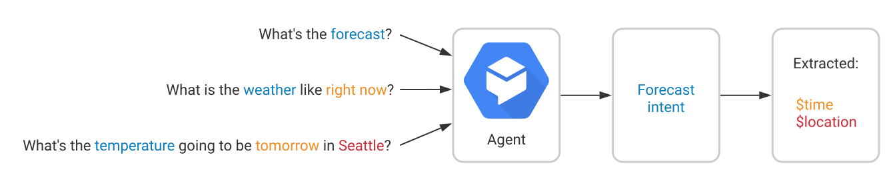
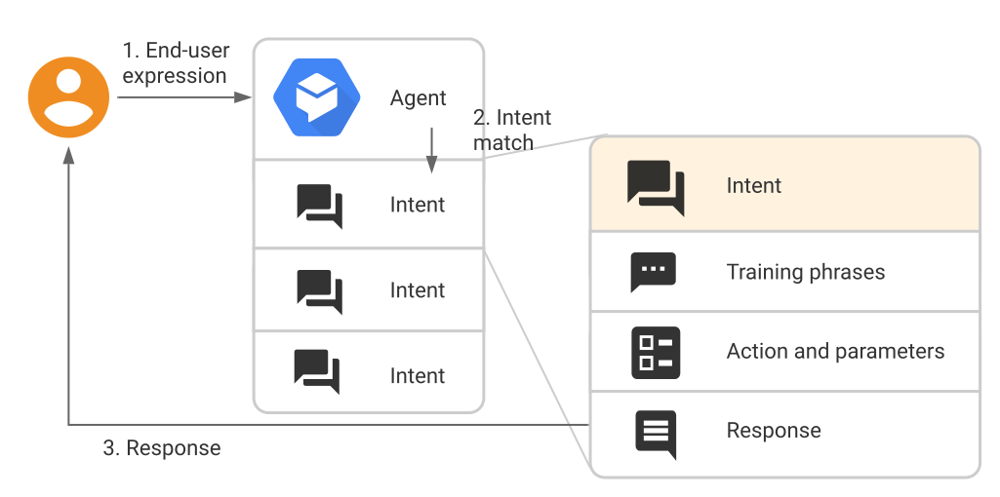

# Google Dialog Flow

## Concepts

Chat bot
NLU Natural language Understanding

## Intents

Un intent permet de catégoriser l'intention d'un utilisateur final dans le cadre d'un tour de conversation. Pour chaque agent, vous définissez un grand nombre d'intents, sachant que l'ensemble de ces intents combinés permet de traiter une conversation complète. Chaque fois qu'un utilisateur final écrit ou dit quelque chose, Dialogflow fait correspondre cette expression de l'utilisateur final à l'intent le plus approprié au sein de votre agent. La mise en correspondance des intents est également appelée classification des intents.

Par exemple, supposons que vous vouliez définir un agent de prévisions météo capable de reconnaître les questions posées par les utilisateurs finaux à propos du temps et d'y répondre. Vous définirez probablement un intent pour les questions concernant les prévisions météorologiques. Lorsqu'un utilisateur final demande : "Quelles sont les prévisions météo ?", Dialogflow met en correspondance cette expression de l'utilisateur final avec l'intent de prévision météo. Vous pouvez également définir un intent de manière à extraire des informations utiles de l'expression de l'utilisateur final, telles que l'heure ou le lieu pour lesquels les prévisions météo sont demandées. Ces données extraites sont essentielles pour permettre à votre système d'exécuter une requête de prévision météo pour l'utilisateur final.

Un intent de base se compose des éléments suivants :

- **Phrases d'entraînement** : il s'agit d'exemples d'expressions correspondant à ce que les utilisateurs finaux sont susceptibles de dire.
- **Action** : Lorsqu'un intent est mis en correspondance, Dialogflow fournit l'action à effectuer au système.
- **Paramètres** : Lors d'une correspondance, Dialogflow fournit les valeurs extraites de l'expression de l'utilisateur final en tant que paramètres. Chaque paramètre est associé à un type, appelé type d'entité, qui détermine la manière exacte dont les données sont extraites.
- **Réponses** : Ce sont des éléments prédéfinis pour répondre à l'utilisateur.

## Entités

Chaque paramètre d'intent possède un type, appelé type d'entité, qui détermine la manière exacte dont les données sont extraites d'une expression d'utilisateur final.

Dialogflow fournit des entités système prédéfinies correspondant à de nombreux types de données courants. Par exemple, il existe des entités système pour la mise en correspondance des dates, des heures, des couleurs, des adresses e-mail, etc. Vous pouvez également créer vos propres entités personnalisées pour la mise en correspondance de données personnalisées. Par exemple, vous pouvez définir une entité légume pouvant être mise en correspondance avec les types de légumes proposés dans une épicerie.

## Contexte

## Agent
